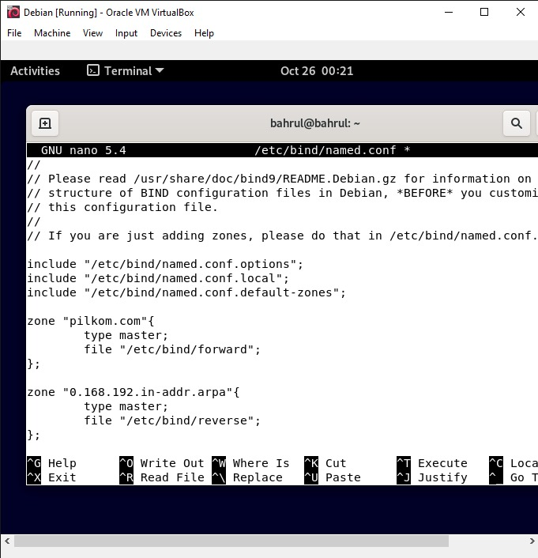
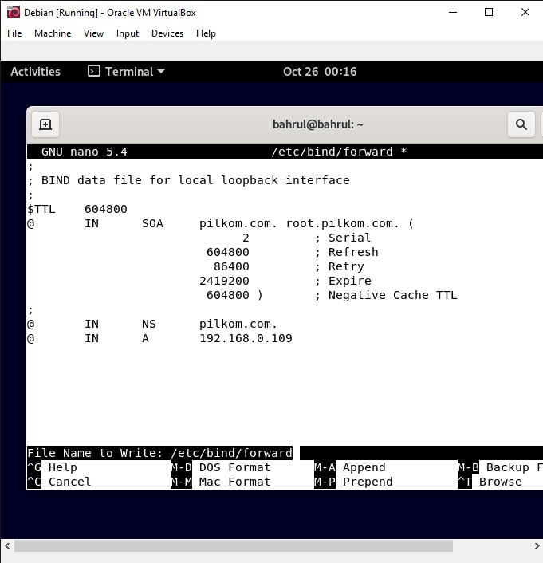
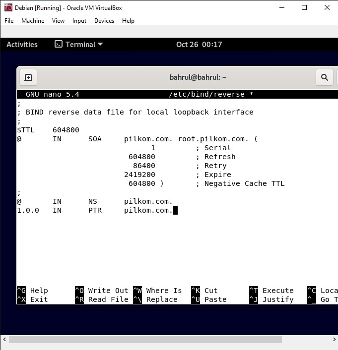
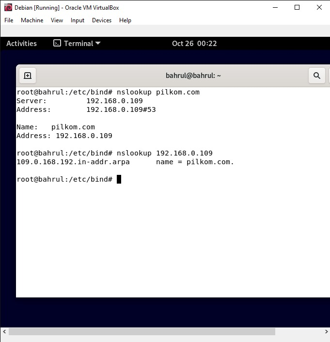

## DNS

        Anggota Kelompok :

        1. Muhammad Bahrul Fahmi (2010131210007)

        2. Muhammad Fikri Abrar (2010131210016)

        3. Zulfian Yafi Rizani (2010131210012)

1. Instalasi 

- Lakukan instalasi dengan mengetikkan perintah "apt-get install bind9"

2. Konfigurasi DNS Server

- Membuat domain dari server linux dengan menggunakan TLD (Top Level Domain). TLD ini hanya berfungsi pada jaringan lokal saja. Langkahnya adalah dengan mengkonfigurasi file named.conf yang terdapat pada direktori /etc/bind. File ini berfungsi sebagai informasi zona dan direkori file forward dan reserve. Perintahnya adalah "nano /etc/bind/named.conf"

File forward berfungsi untuk mengkonversi alamat domain ke alamat IP, sedangkan file reverse berlaku sebaliknya yaitu mengkonversi alamat IP server ke domain.

- Selanjutnya buka file forward, dengan mengetikkan perintah "nano /etc/bind/forward"

Ganti localhost dengan hostname “pilkom.com” seperti yang sudah di buat sebelumnya, sehingga menjadi seperti berikut:

- Selanjutnya, Konfigurasi file reverse dengan mengetikkan perintah "nano /etc/bind/reverse"

Ganti localhost dengan alamat hostname seperti file forward di atas:

3. Pengujian DNS Server

- Lakukan pengujian dengan cara mengetikkan perintah "nslookup pilkom.com". pilkom.com adalah nama domain yang kita buat

Hasilnya adalah sebagai berikut :

