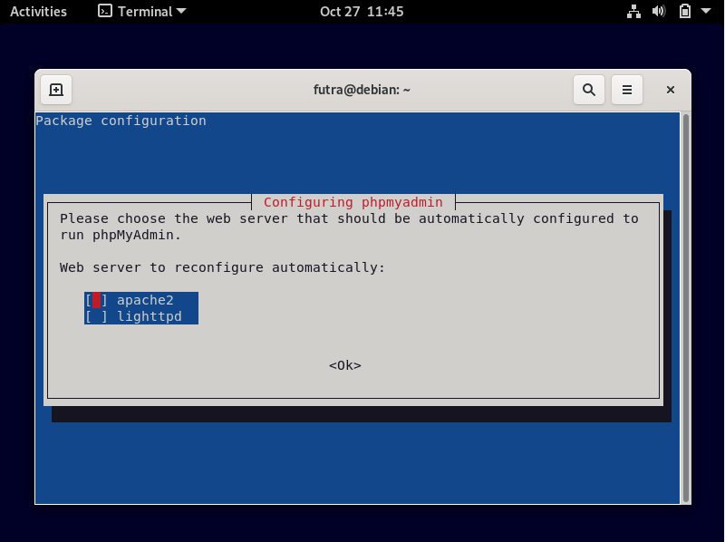

## Database Server

        Anggota Kelompok :

        1. Muhammad Bahrul Fahmi (2010131210007)

        2. Muhammad Fikri Abrar (2010131210016)

        3. Zulfian Yafi Rizani (2010131210012)

1. Instalasi 

- Pertama-tama, masuk ke debian anda dengan menggunakan user root dengan cara mengetikkan perintah "su" pada terminal linux debian. Setelah itu ketikkan "apt-get install mysql-server" untuk menginstall database pada server kita.

- Selanjutnya kita akan menginstall phpmyadmin, aplikasi ini digunakan untuk memudahkan user yang tidak terbiasa dengan command line karena aplikasi ini menggunakan GUI. Untuk menginstallnya silahkan ketikkan perintah "apt-get install phpmyadmin". 

- Pilih apache2 sebagai web server yang digunakan.

- Pilih Yes

- Selanjutnya, kalian akan diminta untuk memasukkan root password dan konfirmasi password pada saat installasinya berjalan. Kemudian buat password sesuai keinginan anda.

2. Konfigurasi 

- Silahkan kalian buka browser dalam linuxnya lalu ketikkan alamat (IP server kalian)/phpmyadmin.

- Kemudian masukkan username dan password yang sebelumnya sudah dibuat.

Jika semua proses yang anda lakukan sudah sama seperti dengan Langkah-langkah di atas, maka anda sudah berhasil menjalankan Database Srver.
