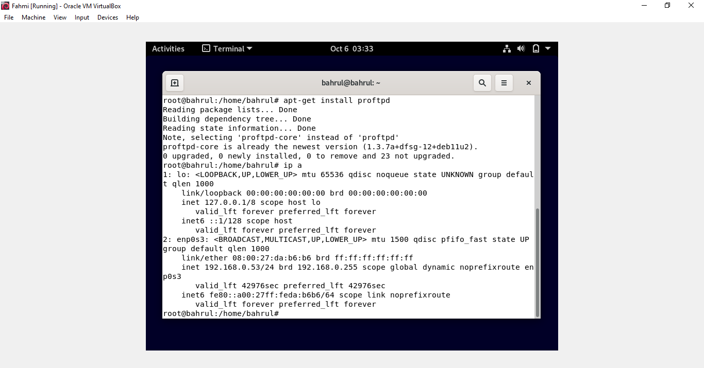

# FTP-Server
       Anggota Kelompok :

        1. Muhammad Bahrul Fahmi (201031210007)

        2. Muhammad Fikri Abrar (2010131210016)

        3. Zulfian Yafi Rizani (2010131210012)

Jika anda mengalami kondisi seperti ini saat menginstall FTP-server, maka anda bisa mengedit pada bagian /etc/apt/sorces.list.

Anda bisa mengeedit seperti contoh di atas, kemudian lakukan apt-get update. 

Kemudian install ulang, jika sudah terinstall maka cek IP anda untuk mengkoneksikan ke filezila.

Kemudian jika anda sudah menginstall filezila, isi host dengan IP anda, username dengan nama debian anda, dan password debian anda, serta port 21. Kemudian klik quickconnect. Filezila siap digunakan.
