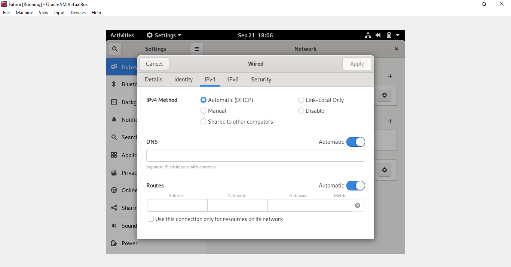
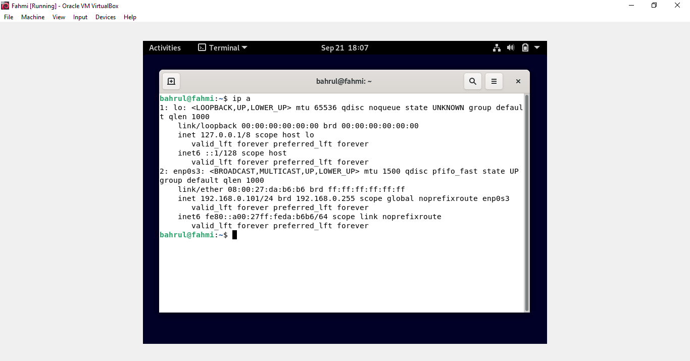
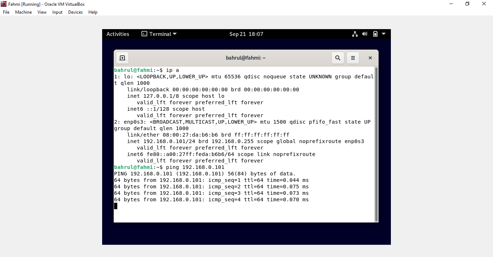
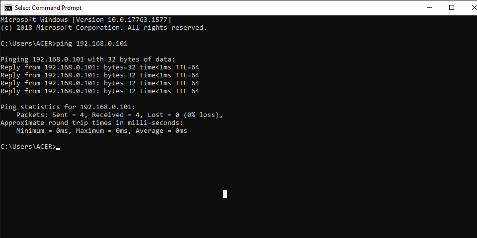

# Membuat Client-Server

        Anggota Kelompok :

        1. Muhammad Bahrul Fahmi

        2. Muhammad Fikri Abrar

        3. Zulfian Yafi Rizani

- Kita akan menyetting secara otomatis jadi pilih yang yang otomatis. Kemudian untuk DNS dan Routesnya kita otomatiskan juga. Di sini kami menggunakan DHCP otomatis, jadi IP nya otomatis terisi

- Di sini IP nya 192.168.0.101

