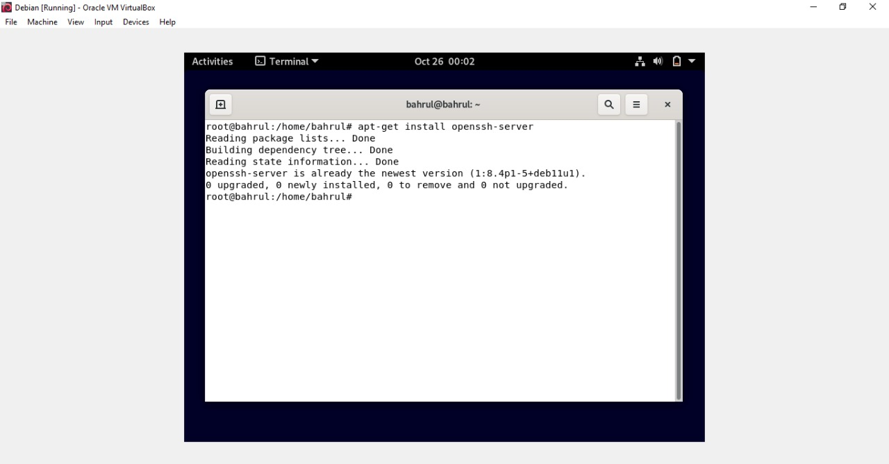
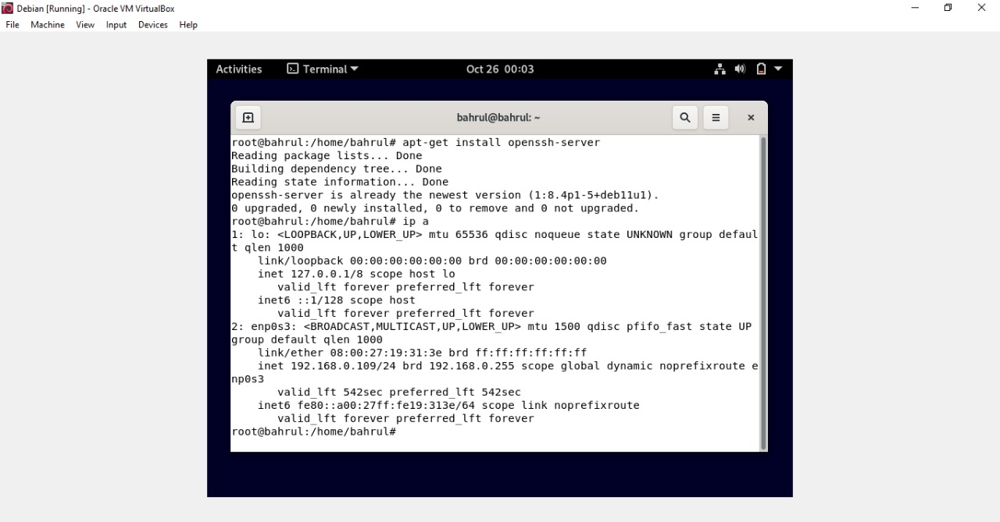
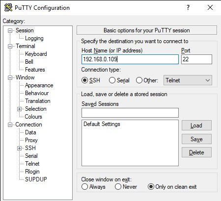
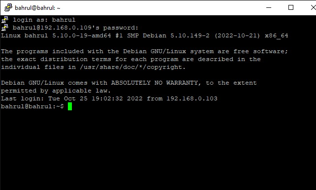

## Remote Access 
        Anggota Kelompok :

        1. Muhammad Bahrul Fahmi (2010131210007)

        2. Muhammad Fikri Abrar (2010131210016)

        3. Zulfian Yafi Rizani (2010131210012)

1. Instalasi 

- Langkah pertama buka Debian kemudian masuk ke super user dengan command su dan masukkan passwordnya
- Selanjutnya, Setelah berhasil masuk ke super user, silahkan install SSH (Secure Shell) dengan menjalankan command apt-get install openssh-server.

2. Testing

- Pada tahap ini, pertama-tama kita membutuhkan ip adress linux. Di sini saya mengetikkan perintah ip a untuk menampilkan ip addres linux yang kita miliki

- Selanjutnya, kita akan melakukan testing ssh server yang dilakukan dari computer client, kali ini computer client menggunakan system operasi windows, untuk itu kita membutuhkan aplikasi tambahan yaitu Putty. 

- Pada Host Name, kita isi dengan menggunakan ip address kita tadi dan mengunakan port 22 seperti berikut ini :

- Selanjutnya, masukkan nama user di Debian dan passwordnya

- Jika tampilan yang muncul sudah seperti gambar di atas, maka computer server anda berhasil diremote dengan computer client.