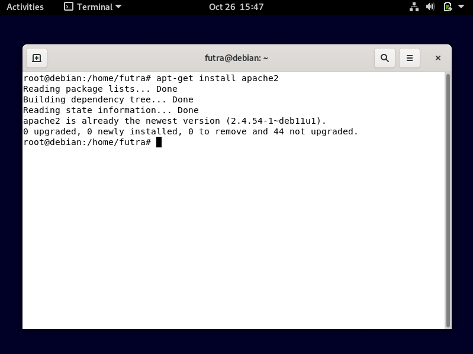
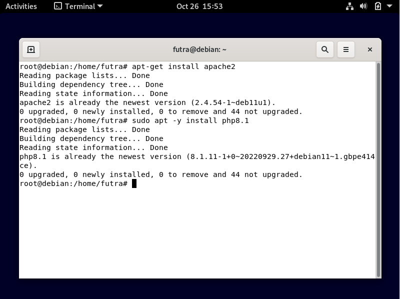
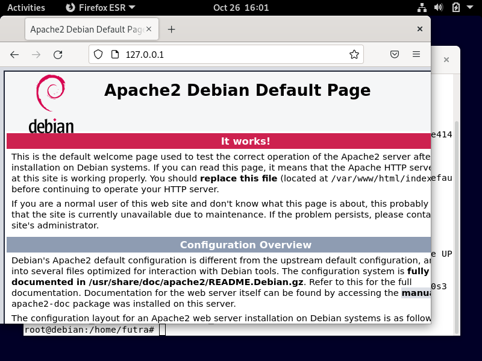
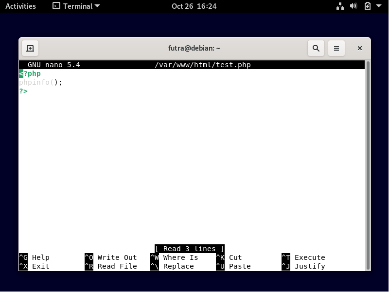
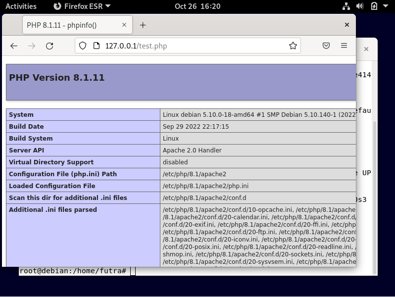

## Web Server

        Anggota Kelompok :

        1. Muhammad Bahrul Fahmi (2010131210007)

        2. Muhammad Fikri Abrar (2010131210016)

        3. Zulfian Yafi Rizani (2010131210012)

1. Instalasi 

- Pertama-tama, masuk ke debian anda dengan menggunakan user root dengan cara mengetikkan perintah "su" pada terminal linux debian. Setelah itu ketikkan "apt-get install apache2" untuk menginstall apache

- Selanjutnya, kita akan menginstal php8 dengan cara mengetikkan "apt-get install php8.1"

2. Konfigurasi
- Kita bisa melihat hasilnya dengan mengunjungi web browser dan mengetikkan alamat IP server kita (jalankan command ip a untuk melihat IP server). Maka akan muncul seperti gambar dibawah ini

- Kali ini kita akan menguji menggunakan script php untuk menampilkan info php pada server kita, Kita akan membuat skrip php pada folder /var/www. Silahkan jalankan command nano /var/www/html/test.php. Setelah itu masukkan skrip seperti pada gambar di bawah

- Selanjutnya, buka browser dalam linuxnya lalu ketikkan (IP server kalian)/test.php. Maka akan muncul laman tentang info dari php yang kita install pada server

Jika semua proses yang anda lakukan sudah sama seperti dengan gambar di atas, maka anda sudah berhasil menjalankan web server.